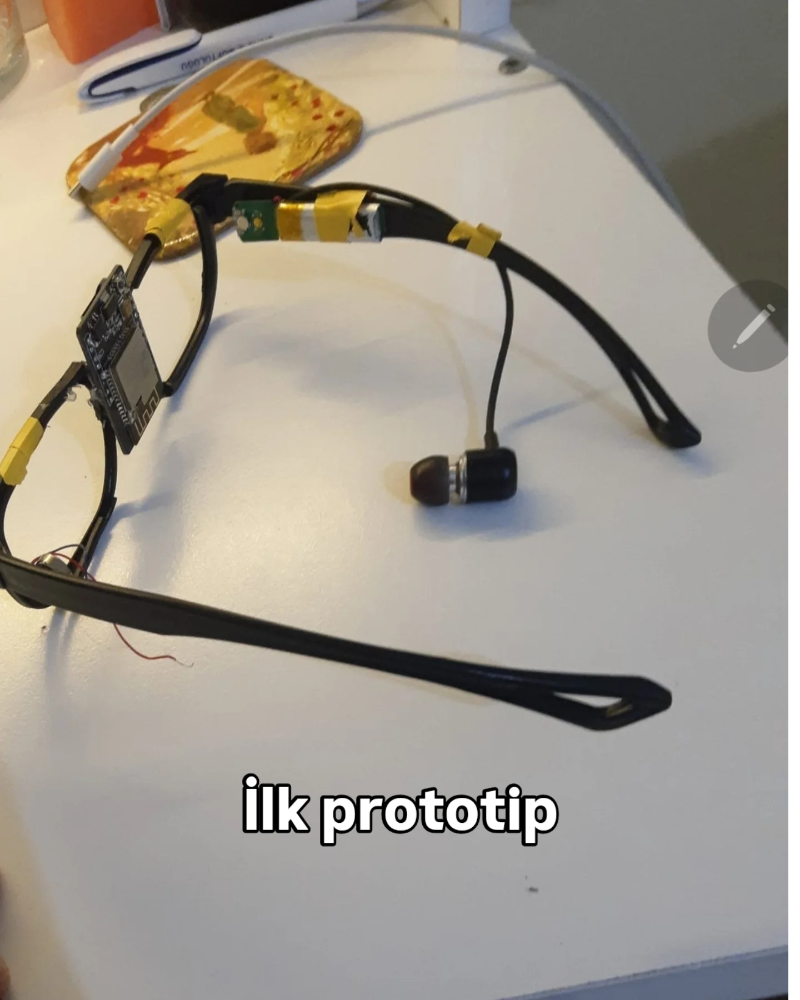
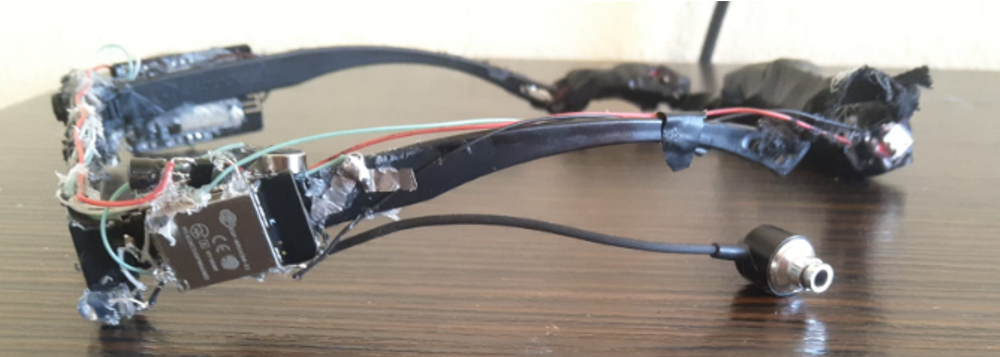

# Embedded AI Vision Glass (EGG)

**Read in Other Languages**

<a href="./README.md">🇺🇸 English</a> | <a href="./docs/tr/README.md">🇹🇷 Türkçe</a> | <a href="./docs/de/README.md">🇩🇪 Deutsch</a> | <a href="./docs/es/README.md">🇪🇸 Español</a> | <a href="./docs/fr/README.md">🇫🇷 Français</a> | <a href="./docs/ru/README.md">🇷🇺 Русский</a> | <a href="./docs/zh-CN/README.md">🇨🇳 中文</a>

<!-- MAIN BANNER: ACHIEVEMENT and THE FIRST PROTOTYPE SIDE-BY-SIDE -->

  
  

| **Project Summary** |
| :---: |
| This project documents the journey of a high school student who single-handedly designed, built, and coded an AI-powered smart glass prototype from scratch, using personal funds. The "Embedded AI Vision Glass" (EGG) is an award-winning assistive device created to enhance the independence of visually impaired individuals by interpreting their environment. It transforms the abstract concept of sight into tangible information through object recognition, text-to-speech, and live translation. |

This repository serves as a comprehensive technical archive for the EGG project, detailing its entire lifecycle. It is designed as a portfolio showcase and a reference for those interested in embedded systems, IoT, and applied AI.

**Disclaimer:** The source code and design files in this repository are provided for demonstration purposes only. All rights are reserved, and this project is **not open-source**.

---

## Project Outline

This project chronicles the creation of the EGG in 5 main chapters, each detailed in its respective document:

*   **[Chapter I: The Idea and The "Why"](./5_Project_Documentation/1_The_Idea_and_The_Why.md)**
    The motivation behind the project and the vision for creating a true cognitive sight experience.

*   **[Chapter II: Hardware Architecture & Assembly](./5_Project_Documentation/2_Hardware_Architecture.md)**
    A deep dive into the hardware decisions, including the **Dual-MCU Architecture**, power management system, and hands-on assembly process.

*   **[Chapter III: The Software Ecosystem](./5_Project_Documentation/3_Software_Ecosystem.md)**
    An explanation of the three-tiered software structure: **Firmware** (Embedded C++), **Cloud Backend** (AWS Serverless), and the **Mobile Application** (Android).

*   **[Chapter IV: Capabilities and Live Demos](./5_Project_Documentation/4_Capabilities_and_Demos.md)**
    A showcase of what the EGG can do, with details on **AI-Powered Vision** (OCR, Object Detection), the dynamic touch interface, and connectivity modes.

*   **[Chapter V: Competitions, Challenges, and Learnings](./5_Project_Documentation/5_Competitions_and_Learnings.md)**
    Reflections on the journey, including winning 3rd place at an international robotics competition, the feedback from TEKNOFEST judges, and the invaluable lessons learned.

## 🛠️ Technical Architecture

The EGG project is a full-stack IoT solution built on a three-tier architecture.

  
   
  <em>Click on the image to see the full annotated schematic.</em>

## 🖼️ Project Showcase: From Idea to Award

This project is the story of an idea evolving into a tangible prototype and, ultimately, an award-winning creation.

| 1. "Bare-Metal" Prototype | 2. The Awards | 3. Live Demo (Video) |
| :---: | :---: | :---: |
| _The first functional version, with all components hand-assembled and taped, without a final enclosure._ | _The medals won at the Sivas International Robotics Competition in the AI and Thematic Robot categories._ | _A live test of the voice-activated flashlight feature. (Click image to play)_ |
|  |  |  |

---

## ⚖️ Copyright and License

**© 2024, Şems YEKELER. All Rights Reserved.**

The source code, hardware schematics, and all other assets in this repository are provided for portfolio and demonstration purposes only. You may view the code for educational purposes, but you are not permitted to copy, modify, distribute, or use them in any way, for commercial or non-commercial purposes, without explicit written permission from the author.

**This project is NOT open-source.**
