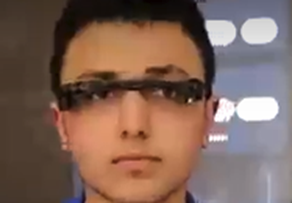

# Embedded AI Vision Glass (EGG)

**Read in Other Languages**

<a href="README.md">🇺🇸 English</a> | <a href="README_tr.md">🇹🇷 Türkçe</a>

  

| **Project Summary** |
| :---: |
| This project documents the journey of a high school student who single-handedly designed, built, and coded an AI-powered smart glass prototype from scratch, using personal funds. The "Embedded AI Vision Glass" (EGG) is an award-winning assistive device created to enhance the independence of visually impaired individuals by interpreting their environment. It transforms the abstract concept of sight into tangible information through object recognition, text-to-speech, and live translation. |

This repository serves as a comprehensive technical archive for the EGG project, detailing its entire lifecycle. It is designed as both a portfolio showcase and a reference for those interested in embedded systems, IoT, and applied AI.

**Disclaimer:** The source code and design files in this repository are provided for demonstration purposes only. All rights are reserved.

---

## 📂 Project Structure

This project is organized into five main sections, each documenting a different aspect of the development process:

*   **[1_Hardware_Design](./1_Hardware_Design/):** Contains all schematics (Fritzing) and physical layout diagrams.
*   **[2_Firmware](./2_Firmware/):** Includes the C++/Arduino source code for both the ESP32 Controller and the ESP32-CAM Processor.
*   **[3_Cloud_Backend](./3_Cloud_Backend/):** Holds the Node.js source code for the AWS Lambda function and the EC2 WebSocket server.
*   **[4_Mobile_Application](./4_Mobile_Application/):** Contains the source code for the Android companion app.
*   **[5_Project_Documentation](./5_Project_Documentation/):** An extensive archive of all reports, presentations, and media files from the project's journey.

## 🛠️ Technical Architecture

The EGG project is a full-stack IoT solution built on a three-tier architecture.

  
   
  <em>Click to see the full annotated schematic.</em>

*   **Hardware & Embedded:** A **Dual-MCU Architecture** (ESP32-WROOM-32 + ESP32-CAM) is used to distribute tasks efficiently. The main controller handles UI and Bluetooth, while a dedicated processor manages the camera, Wi-Fi, and AI-related tasks. The two communicate via UART, overcoming the performance issues of running Wi-Fi and Bluetooth simultaneously on a single MCU.
*   **Cloud Backend:** A serverless architecture on **AWS** performs all heavy AI processing. This includes **API Gateway** for requests, **Lambda** for logic, **S3** for storage, and AI services like **AWS Textract** (OCR) and **AWS Rekognition** (Object/Face/Currency Detection).
*   **Mobile App (Android):** A user-friendly interface to control the glasses and receive real-time results via Bluetooth and a cloud backend. It utilizes a Text-to-Speech (TTS) engine and the Google Translate API for multilingual support.

## 🌟 Key Features

*   **Text Analysis (OCR):** Reads text from documents and signs.
*   **Live Text Translation:** Translates and reads foreign text.
*   **Scene Description:** Identifies objects in the user's surroundings.
*   **Dual Control System:** Can be controlled via on-board capacitive touchpads or voice commands through the companion app.
*   **Connectivity Modes:** Includes a **Live Video Streaming** mode via WebSockets and an **FTP Server Mode** for wireless access to photos on the SD card.
*   **Assistive Features:** Integrated Bluetooth headset for audio feedback and a voice-activated high-intensity LED flashlight.

## 🖼️ Project Showcase: From Idea to Award-Winning Prototype

This project evolved from a simple concept to a functional prototype that was recognized in international competitions.

| 1. Prototyping & Assembly | 2. Competition & Recognition | 3. Live Demonstration |
| :---: | :---: | :---: |
| _The "bare-metal" prototype, showing the hand-assembled components, including a modified BT headset and custom-wired modules._ | _Receiving the 3rd place award in the AI category at the Sivas International Robotics Competition._ | _A live test showcasing the voice-activated flashlight feature, a core capability of the onboard assistant._ |
|  |  |  |

---

## ⚖️ Copyright and License

**© 2024, [SENİN ADIN SOYADIN]. All Rights Reserved.**

The source code, hardware schematics, and all other assets in this repository are provided for portfolio and demonstration purposes only. You may view the code and assets for educational purposes, but you are not permitted to copy, modify, distribute, or use them in any way, for commercial or non-commercial purposes, without explicit written permission from the author.

**This project is NOT open-source.**
