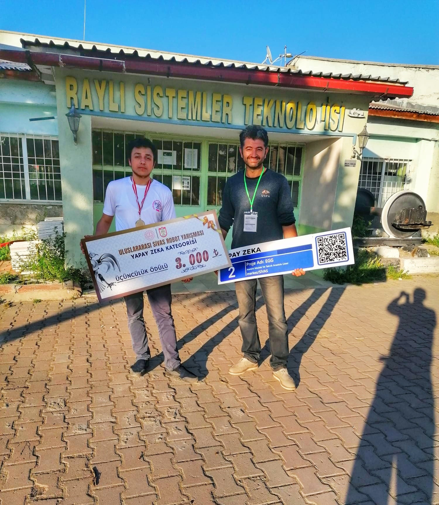
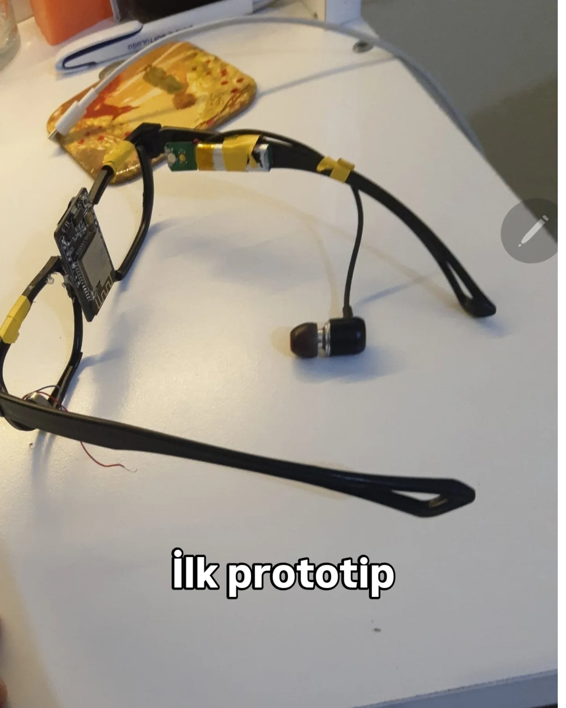
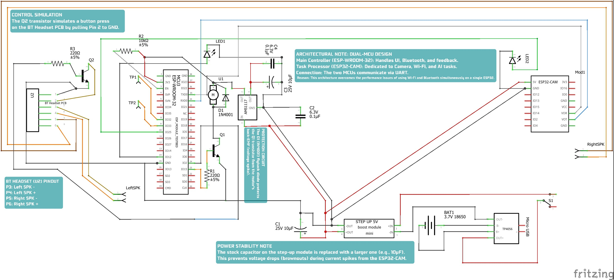
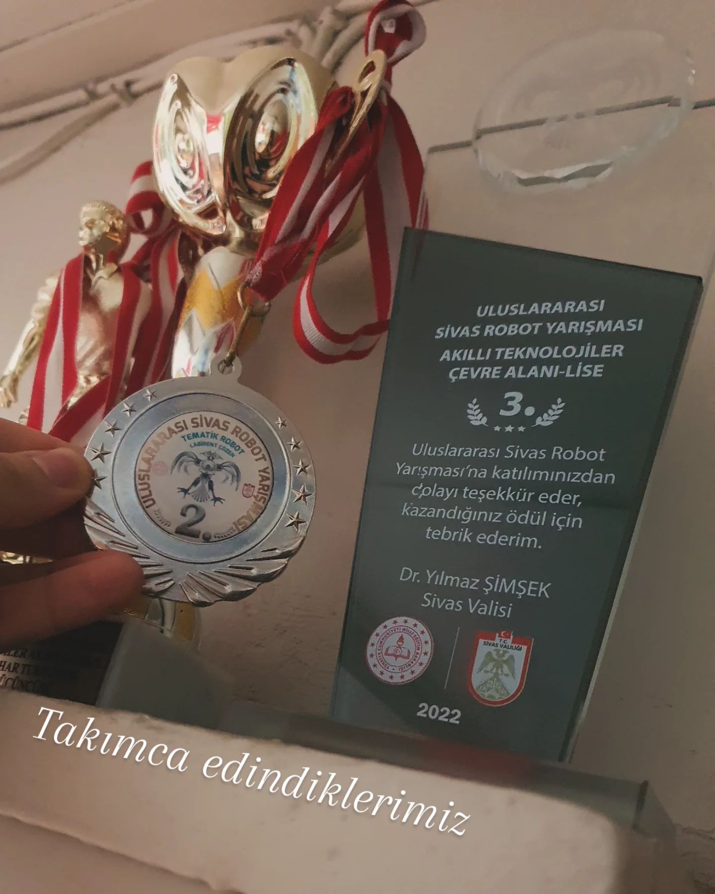

# Embedded AI Vision Glass (EGG)

**Read in Other Languages**

<a href="./README.md">🇺🇸 English</a> | <a href="./docs/tr/README.md">🇹🇷 Türkçe</a> | <a href="./docs/de/README.md">🇩🇪 Deutsch</a> | <a href="./docs/es/README.md">🇪🇸 Español</a> | <a href="./docs/fr/README.md">🇫🇷 Français</a> | <a href="./docs/ru/README.md">🇷🇺 Русский</a> | <a href="./docs/zh-CN/README.md">🇨🇳 中文</a>

<!-- MAIN BANNER: ACHIEVEMENT and THE FIRST PROTOTYPE SIDE-BY-SIDE -->

  
  

| **Project Mission** |
| :---: |
| This project is a technology manifesto, brought to life by a high school student with personal funds, aiming to fundamentally change how visually impaired individuals perceive the world. The mission is to create an assistive device that doesn't just warn about an obstacle, but **describes and interprets the environment**—a cognitive companion that can say "the sign ahead reads 'exit'" instead of just beeping. This vision was validated by winning an award at an international robotics competition. |

This repository serves as a comprehensive technical archive for the EGG project, detailing its entire lifecycle from concept to an award-winning prototype.

**Disclaimer:** The source code and design files in this repository are provided for demonstration purposes only. All rights are reserved, and this project is **not open-source**.

---

## Project Anatomy

This project chronicles the creation of the EGG in 5 main chapters:

*   **[Chapter I: The Idea and The "Why"](./5_Project_Documentation/1_The_Idea_and_The_Why.md)**
*   **[Chapter II: Hardware Architecture & Assembly](./5_Project_Documentation/2_Hardware_Architecture.md)**
*   **[Chapter III: The Software Ecosystem](./5_Project_Documentation/3_Software_Ecosystem.md)**
*   **[Chapter IV: Capabilities and Live Demos](./5_Project_Documentation/4_Capabilities_and_Demos.md)**
*   **[Chapter V: Competitions, Challenges, and Learnings](./5_Project_Documentation/5_Competitions_and_Learnings.md)**

## 🛠️ Technical Architecture

  
   
  <em>Click on the image to see the full annotated schematic.</em>

## 🖼️ Project Showcase: From Idea to Award-Winning Device

| 1. Final Prototype Tour (Video) | 2. Competition Awards | 3. Live Assistant Test (Video) |
| :---: | :---: | :---: |
| _A 360-degree tour of the final prototype, showcasing the component integration and physical design._ | _The medals won at the Sivas International Robotics Competition in the AI and Thematic Robot categories._ | _A live test of the voice-activated flashlight feature, proving the system's interactivity._ |
|  |  |  |

---

## ⚖️ Copyright and License

**© 2024, Şems YEKELER. All Rights Reserved.**

The source code, hardware schematics, and all other assets in this repository are provided for portfolio and demonstration purposes only. You may view the code for educational purposes, but you are not permitted to copy, modify, distribute, or use them in any way, for commercial or non-commercial purposes, without explicit written permission from the author.

**This project is NOT open-source.**
