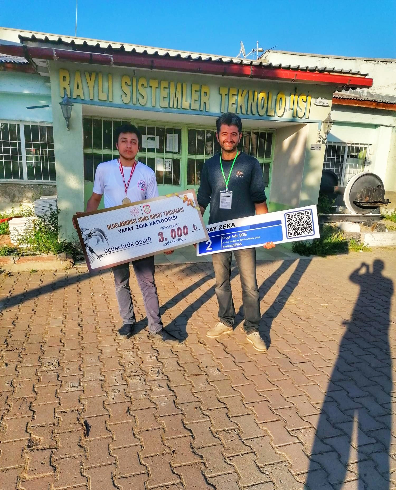

# Embedded AI Vision Glass (EGG)

**Read in Other Languages**

<a href="./README.md">🇺🇸 English</a> | <a href="./docs/tr/README.md">🇹🇷 Türkçe</a> | <a href="./docs/de/README.md">🇩🇪 Deutsch</a> | <a href="./docs/es/README.md">🇪🇸 Español</a> | <a href="./docs/fr/README.md">🇫🇷 Français</a> | <a href="./docs/ru/README.md">🇷🇺 Русский</a> | <a href="./docs/zh-CN/README.md">🇨🇳 中文</a>

  

| **Project Summary** |
| :---: |
| This project documents the journey of a high school student who single-handedly designed, built, and coded an AI-powered smart glass prototype from scratch, using personal funds. The "Embedded AI Vision Glass" (EGG) is an award-winning assistive device created to enhance the independence of visually impaired individuals by interpreting their environment. It transforms the abstract concept of sight into tangible information through object recognition, text-to-speech, and live translation. |

This repository serves as a comprehensive technical archive for the EGG project, detailing its entire lifecycle. It is designed as a portfolio showcase and a reference for those interested in embedded systems, IoT, and applied AI.

**Disclaimer:** The source code and design files in this repository are provided for demonstration purposes only. All rights are reserved, and this project is **not open-source**.

---

## Project Outline

This project chronicles the creation of the EGG in 5 main chapters, each detailed in its respective document:

*   **[Chapter I: The Idea and The "Why"](./5_Project_Documentation/1_The_Idea_and_The_Why.md)**
    The motivation behind the project and the vision for creating a true cognitive sight experience.

*   **[Chapter II: Hardware Architecture & Assembly](./5_Project_Documentation/2_Hardware_Architecture.md)**
    A deep dive into the hardware decisions, including the **Dual-MCU Architecture**, power management system, and hands-on assembly process.

*   **[Chapter III: The Software Ecosystem](./5_Project_Documentation/3_Software_Ecosystem.md)**
    An explanation of the three-tiered software structure: **Firmware** (Embedded C++), **Cloud Backend** (AWS Serverless), and the **Mobile Application** (Android).

*   **[Chapter IV: Capabilities and Live Demos](./5_Project_Documentation/4_Capabilities_and_Demos.md)**
    A showcase of what the EGG can do, with details on **AI-Powered Vision** (OCR, Object Detection), user interface, and connectivity modes.

*   **[Chapter V: Competitions, Challenges, and Learnings](./5_Project_Documentation/5_Competitions_and_Learnings.md)**
    Reflections on the journey, including winning 3rd place at an international robotics competition, feedback from TEKNOFEST judges, and the lessons learned.

## 🖼️ Project Showcase

| 1. Prototyping & Assembly | 2. Competition & Recognition | 3. Live Demonstration |
| :---: | :---: | :---: |
| _The "bare-metal" prototype, showing the hand-assembled and custom-wired modules._ | _Receiving the 3rd place award in the AI category at the Sivas International Robotics Competition._ | _A live test of the voice-activated flashlight, a core capability of the onboard assistant._ |
|  |  |  |

---

## ⚖️ Copyright and License

**© 2024, Şems YEKELER. All Rights Reserved.**
