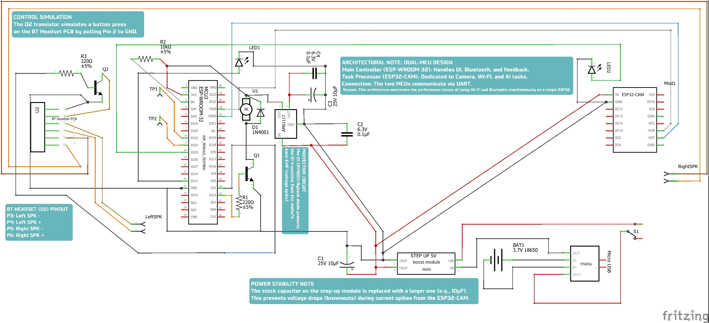

<!-- Diğer dillere link (şimdilik sadece İngilizce var) -->
[Read the English Version (İngilizce Versiyonu Okuyun) »](README.md)

---

  <!-- Proje Banner'ı (Ödüllü fotoğraf ile güncellendi) -->
  

  <h1 align="center">Gömülü Yapay Zeka Görü Gözlüğü (EGG)</h1>

  

    Görme engelli bireylere yardımcı olmak amacıyla bir lise öğrencisi tarafından geliştirilen, ödüllü ve yapay zeka destekli bir akıllı gözlük projesinin portfolyo sunumudur.
     
    <a href="#-proje-hakkında"><strong>Proje Hakkında</strong></a> ·
    <a href="#-teknik-mimari"><strong>Teknik Mimari</strong></a> ·
    <a href="#-proje-vitrini"><strong>Proje Vitrini</strong></a>
  

---

### 🏆 Proje Hakkında

**Gömülü Yapay Zeka Görü Gözlüğü (EGG)**, görme engelli bireylerin günlük hayatta karşılaştığı zorluklara çözüm üretmek amacıyla, tek bir lise öğrencisi tarafından tamamen kişisel imkanlarla tasarlanıp geliştirilmiş, ileri teknoloji bir yardımcı prototiptir.

Bu proje, geleneksel yardımcı cihazların aksine, sadece engelleri tespit etmekle kalmaz, aynı zamanda kullanıcının çevresini **anlamlandırır ve betimler**. Sadece bir uyarı sesi vermek yerine, "önünde bir sandalye var" diyebilir veya bir tabeladaki yazıyı sesli olarak okuyabilir. Bu sayede, bilişsel bir "görme" yeteneği sunarak kullanıcının bağımsızlığını artırmayı hedefler.

Projenin yenilikçi yapısı ve potansiyeli, katıldığı **Sivas Uluslararası Robot Yarışması**'nda **Yapay Zeka Kategorisi Üçüncülük Ödülü** alarak bağımsız bir jüri tarafından tescillenmiştir.

### 📂 Proje Dosyaları

Bu repo, projenin tüm yaşam döngüsünü belgeleme amacıyla beş ana bölüme ayrılmıştır:

*   **[1_Hardware_Design](./1_Hardware_Design/):** Tüm Fritzing şemalarını ve fiziksel yerleşim çizimlerini içerir.
*   **[2_Firmware](./2_Firmware/):** ESP32 Kontrol Ünitesi ve ESP32-CAM Kamera Ünitesi için yazılmış C++/Arduino kodlarını barındırır.
*   **[3_Cloud_Backend](./3_Cloud_Backend/):** AWS Lambda fonksiyonu ve EC2 WebSocket sunucusu için hazırlanan Node.js kodlarını içerir.
*   **[4_Mobile_Application](./4_Mobile_Application/):** Android yardımcı uygulamasının kaynak kodlarını barındırır.
*   **[5_Project_Documentation](./5_Project_Documentation/):** Proje süresince hazırlanan tüm raporları, sunumları, görselleri ve videoları içeren geniş bir arşivdir.

### 🛠️ Teknik Mimari

EGG projesi, üç katmanlı bir mimariye sahip tam kapsamlı bir IoT çözümüdür.

  
   
  <em>Notlu şemanın tamamını görmek için resme tıklayın.</em>

*   **Donanım ve Gömülü Yazılım:** Görevleri verimli bir şekilde dağıtan **Çift Mikrodenetleyicili (ESP-WROOM-32 + ESP32-CAM)** bir mimariye sahiptir. Ana kontrolcü arayüz ve Bluetooth'u yönetirken, özel işlemci kamera ve Wi-Fi görevlerini üstlenir. İki işlemci UART üzerinden haberleşir.

*   **Sunucu Altyapısı (Bulut):** Maliyeti ve cihaz üzerindeki yükü en aza indirmek için **AWS (Amazon Web Services)** üzerinde "sunucusuz" (serverless) bir mimari kullanılmıştır. Tüm ağır yapay zeka işlemleri (**AWS Textract** ile Metin Okuma, **AWS Rekognition** ile Nesne/Yüz/Para Tanıma) bulutta yapılır.

*   **Mobil Uygulama (Android):** Gözlüğü kontrol etmek ve sonuçları sesli olarak almak için geliştirilmiş bir arayüzdür. Bluetooth ve internet üzerinden gözlükle ve sunucuyla sürekli iletişim halindedir.

### 🌟 Temel Yetenekler

*   **Metin Analizi (OCR):** Doküman ve tabelalardaki metinleri okur.
*   **Canlı Metin Çevirisi:** Yabancı metinleri çevirir ve seslendirir.
*   **Ortam Betimleme:** Çevredeki nesneleri tanır ve kullanıcıya raporlar.
*   **Çift Kontrol Sistemi:** Hem gözlük üzerindeki dokunmatik yüzeyler hem de mobil uygulama üzerinden sesli komutlarla kontrol.
*   **Ek Modlar:** Canlı Video Yayını (WebSocket) ve FTP Sunucu Modu (Kablosuz dosya erişimi).
*   **Yardımcı Özellikler:** Entegre Bluetooth kulaklık ve sesle aktive edilen yüksek yoğunluklu LED fener.

### 🖼️ Proje Vitrini: Fikirden Ödüle Yolculuk

Bu proje, bir fikrin somut bir prototipe ve ardından ödüllü bir çalışmaya dönüşme hikayesidir.

| 1. İlk Montaj ve "Hacking" | 2. Yarışma ve Başarı | 3. Canlı Demo |
| :---: | :---: | :---: |
| _"Çıplak" prototipin ilk halleri. Modifiye edilmiş bir BT kulaklık ve özel olarak kablolanmış modüllerin montajı._ | _EGG projesinin Sivas Uluslararası Robot Yarışması'nda sunulması ve kazanılan ödüller._ | _Dahili asistanın temel bir yeteneği olan sesle etkinleştirilen fener özelliğini gösteren canlı test._ |
|  |  |  |

---

### ⚖️ Telif Hakkı ve Lisans

**© 2024, Şems YEKELER. Her Hakkı Saklıdır.**

Bu projenin kaynak kodları, donanım şemaları ve diğer tüm varlıkları yalnızca portfolyo ve gösterim amacıyla sunulmuştur. Kodları eğitim amacıyla inceleyebilirsiniz, ancak yazarın açık ve yazılı izni olmaksızın kopyalamanız, değiştirmeniz, dağıtmanız veya herhangi bir şekilde kullanmanız yasaktır.

**Bu proje açık kaynak değildir.**
