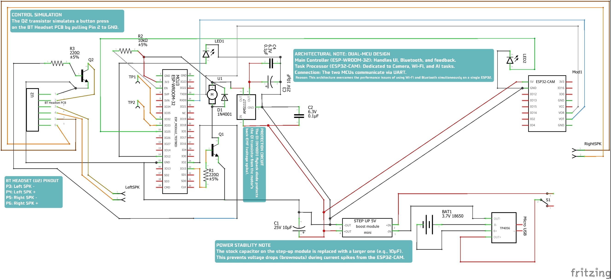
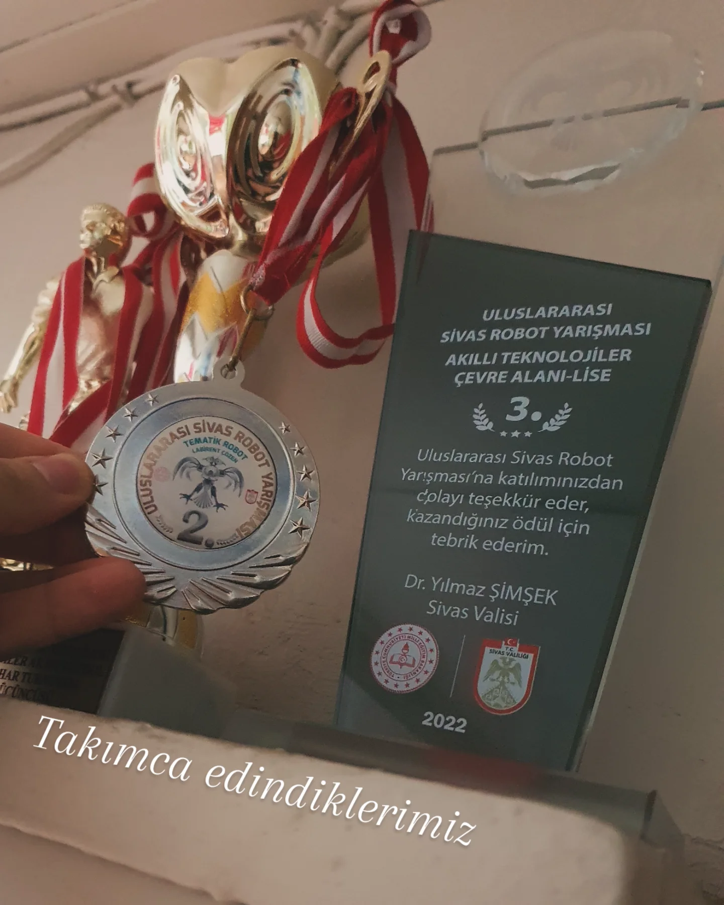

# Gömülü Yapay Zeka Görü Gözlüğü (EGG)

**Diğer Dillerde Oku**

<a href="../../README.md">🇺🇸 English</a> | <a href="./README.md">🇹🇷 Türkçe</a> | <a href="../de/README.md">🇩🇪 Deutsch</a> | <a href="../es/README.md">🇪🇸 Español</a> | <a href="../fr/README.md">🇫🇷 Français</a> | <a href="../ru/README.md">🇷🇺 Русский</a> | <a href="../zh-CN/README.md">🇨🇳 中文</a>

<!-- ANA GÖRSEL: İLK PROTOTİP ve BAŞARI YAN YANA -->

  
  

| **Proje Özeti** |
| :---: |
| Bu proje, bir lise öğrencisinin tamamen kişisel imkanlarıyla, sıfırdan tasarlayıp kodladığı yapay zeka destekli bir akıllı gözlük prototipinin yolculuğunu belgelemektedir. "Engelsiz Görü Gözlüğü" (EGG), çevresini yorumlayarak görme engelli bireylerin bağımsızlığını artırmak amacıyla oluşturulmuş, ödüllü bir yardımcı cihazdır. Soyut "görme" kavramını; nesne tanıma, metinden sese ve canlı çeviri gibi özelliklerle somut bilgiye dönüştürür. |

Bu repo, EGG projesinin ilk konseptinden yarışmada ödül kazanan prototipine kadar tüm yaşam döngüsünü detaylandıran kapsamlı bir teknik arşiv niteliğindedir. Hem bir portfolyo vitrini hem de gömülü sistemler, IoT ve uygulamalı yapay zeka ile ilgilenenler için bir referans olarak tasarlanmıştır.

**Yasal Uyarı:** Bu repodaki kaynak kodları ve tasarım dosyaları yalnızca gösterim amaçlıdır. Tüm hakları saklıdır ve bu proje **açık kaynak değildir**.

---

## Proje Taslağı

Bu proje, EGG'nin yaratılış sürecini 5 ana bölümde anlatmaktadır. Her bölüm, linki verilen kendi dokümanında detaylandırılmıştır:

*   **[Bölüm I: Fikir ve "Neden?"](../../5_Project_Documentation/1_The_Idea_and_The_Why.md)**
    Projenin arkasındaki motivasyon ve basit bir engel tespitinin ötesinde, gerçek bir bilişsel "görü" deneyimi yaratma vizyonu.

*   **[Bölüm II: Donanım Mimarisi ve Montaj](../../5_Project_Documentation/2_Hardware_Architecture.md)**
    **Çift Mikrodenetleyici Mimarisi**, güç yönetimi sistemi ve modifiye edilmiş BT kulaklık gibi donanım kararlarının ve el yapımı montaj sürecinin derinlemesine incelenmesi.

*   **[Bölüm III: Yazılım Ekosistemi](../../5_Project_Documentation/3_Software_Ecosystem.md)**
    Gözlüğü hayata geçiren üç katmanlı yazılım yapısının açıklaması: **Gömülü Yazılım** (C++), **Bulut Altyapısı** (AWS Serverless) ve **Mobil Uygulama** (Android).

*   **[Bölüm IV: Yetenekler ve Canlı Demolar](../../5_Project_Documentation/4_Capabilities_and_Demos.md)**
    EGG'nin yapabildiklerinin bir vitrini. **Yapay Zeka Destekli Görü** (OCR, Nesne Tanıma), dinamik dokunmatik arayüz ve bağlantı modları hakkında detaylar.

*   **[Bölüm V: Yarışmalar, Zorluklar ve Öğrenimler](../../5_Project_Documentation/5_Competitions_and_Learnings.md)**
    Uluslararası bir robotik yarışmasında üçüncülük kazanmak, TEKNOFEST jürilerinden alınan geri bildirimler, aşılan teknik zorluklar ve bu yolculukta kazanılan dersler üzerine düşünceler.

## 🛠️ Teknik Mimari

EGG projesi, üç katmanlı bir mimariye sahip tam kapsamlı bir IoT çözümüdür.

  
   
  <em>Notlu şemanın tamamını görmek için resme tıklayın.</em>

## 🖼️ Proje Vitrini: Fikirden Ödüle Yolculuk

Bu proje, bir fikrin somut bir prototipe ve ardından ödüllü bir çalışmaya dönüşme hikayesidir.

| 1. "Çıplak" Prototip | 2. Ödüller | 3. Canlı Demo |
| :---: | :---: | :---: |
| _Tüm bileşenlerin elle birleştirildiği, bantlarla sabitlendiği ve henüz bir kasası olmayan ilk işlevsel versiyon._ | _Sivas Uluslararası Robot Yarışması'nda Yapay Zeka ve Tematik Robot kategorilerinde kazanılan dereceler._ | _Dahili asistanın temel yeteneklerinden biri olan sesle etkinleştirilen fener özelliğinin canlı testi._ |
|  |  |  |

---

## ⚖️ Telif Hakkı ve Lisans

**© 2024, Şems YEKELER. Her Hakkı Saklıdır.**

Bu projenin kaynak kodları, donanım şemaları ve diğer tüm varlıkları yalnızca portfolyo ve gösterim amacıyla sunulmuştur. Kodları eğitim amacıyla inceleyebilirsiniz, ancak yazarın açık ve yazılı izni olmaksızın kopyalamanız, değiştirmeniz, dağıtmanız veya herhangi bir şekilde kullanmanız yasaktır.

**Bu proje açık kaynak değildir.**
