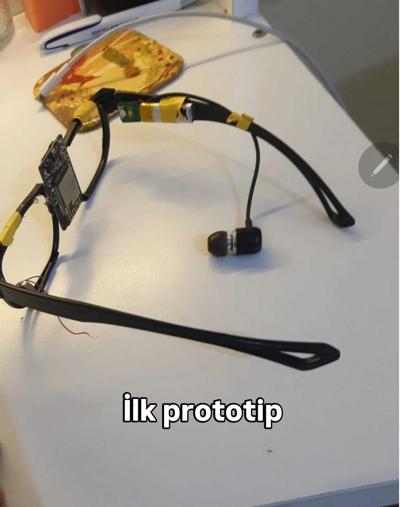

# Gömülü Yapay Zeka Görü Gözlüğü (EGG)

**Diğer Dillerde Oku**

<a href="../../README.md">🇺🇸 English</a> | <a href="./README.md">🇹🇷 Türkçe</a> | <a href="../de/README.md">🇩🇪 Deutsch</a> | <a href="../es/README.md">🇪🇸 Español</a> | <a href="../fr/README.md">🇫🇷 Français</a> | <a href="../ru/README.md">🇷🇺 Русский</a> | <a href="../zh-CN/README.md">🇨🇳 中文</a>

<!-- ANA GÖRSEL: İLK PROTOTİP ve BAŞARI YAN YANA, AÇIKLAMALARIYLA -->

  <table>
    <tr>
      <td align="center" style="padding: 10px; border: none;">
        
         
        <em><b>Resim 1: Fikrin İlk Hali.</b> Elle lehimlenmiş modüller ve modifiye edilmiş bir gözlük çerçevesi ile hayata geçirilen ilk işlevsel prototip.</em>
      </td>
      <td align="center" style="padding: 10px; border: none;">
        
         
        <em><b>Resim 2: Emeğin Tescillenmesi.</b> Sivas Uluslararası Robot Yarışması'nda Yapay Zeka kategorisinde kazanılan üçüncülük ödülü.</em>
      </td>
    </tr>
  </table>

### Misyonumuz

Bu proje, bir lise öğrencisinin, görme engelli bireylerin dünyayı algılama şeklini kökten değiştirmek amacıyla, tamamen kişisel imkanlarıyla sıfırdan hayata geçirdiği bir teknoloji manifestosudur. Misyonumuz, sadece "engel var" diyen bir cihaz değil, kullanıcıya **"önündeki tabelada 'acil çıkış' yazıyor"** diyebilen, çevresini **anlamlandıran ve betimleyen** bir yardımcı yaratmaktır. Bu vizyon, uluslararası bir yarışmada alınan derece ile tescillenmiştir.

Bu repo, projenin tüm yaşam döngüsünü detaylandıran kapsamlı bir teknik arşivdir.

**Yasal Uyarı:** Bu repodaki dosyalar yalnızca gösterim amaçlıdır. Tüm hakları saklıdır ve bu proje **açık kaynak değildir**.

---

### Proje Anatomisi ve Teknik Mimari

EGG projesi, donanım, gömülü yazılım, bulut ve mobil katmanları bir araya getiren tam kapsamlı bir IoT çözümüdür. Projenin teknik kararlarını ve yapısını aşağıdaki notlu şema özetlemektedir.

  
   
  <em>Notlu ve detaylı devre şemasını tam boyutta görmek için resme tıklayın.</em>

*   **Donanım ve Gömülü Yazılım:** Görevleri verimli bir şekilde dağıtan **Çift Mikrodenetleyici Mimarisi** (ESP32 + ESP32-CAM) kullanılmıştır. Ana kontrolcü arayüz ve Bluetooth'u yönetirken, özel işlemci kamera ve Wi-Fi görevlerini üstlenir.
*   **Sunucu Altyapısı (Bulut):** Tüm ağır yapay zeka işlemleri, maliyeti ve cihaz yükünü en aza indirmek için **AWS (Amazon Web Services)** üzerinde "sunucusuz" bir mimaride (Lambda, Textract, Rekognition) çalışır.
*   **Mobil Uygulama (Android):** Gözlüğü kontrol etmek ve işlenen sonuçları sesli olarak almak için geliştirilmiş kullanıcı dostu bir arayüzdür.

### Temel Yetenekler

*   **Metin Analizi (OCR):** Doküman ve tabelalardaki metinleri okur.
*   **Canlı Metin Çevirisi:** Yabancı metinleri çevirir ve seslendirir.
*   **Ortam Betimleme:** Çevredeki nesneleri tanır ve raporlar.
*   **Çift Kontrol Sistemi:** Hem gözlük üzerindeki dokunmatik yüzeyler hem de mobil uygulama üzerinden sesli komutlarla kontrol.
*   **Ek Modlar:** Canlı Video Yayını (WebSocket) ve FTP Sunucu Modu (Kablosuz dosya erişimi).

---

### ⚖️ Telif Hakkı ve Lisans

**© 2024, Şems YEKELER. Her Hakkı Saklıdır.**

Bu projenin kaynak kodları, donanım şemaları ve diğer tüm varlıkları yalnızca portfolyo ve gösterim amacıyla sunulmuştur. Kodları eğitim amacıyla inceleyebilirsiniz, ancak yazarın açık ve yazılı izni olmaksızın kopyalamanız, değiştirmeniz, dağıtmanız veya herhangi bir şekilde kullanmanız yasaktır.

**Bu proje açık kaynak değildir.**
